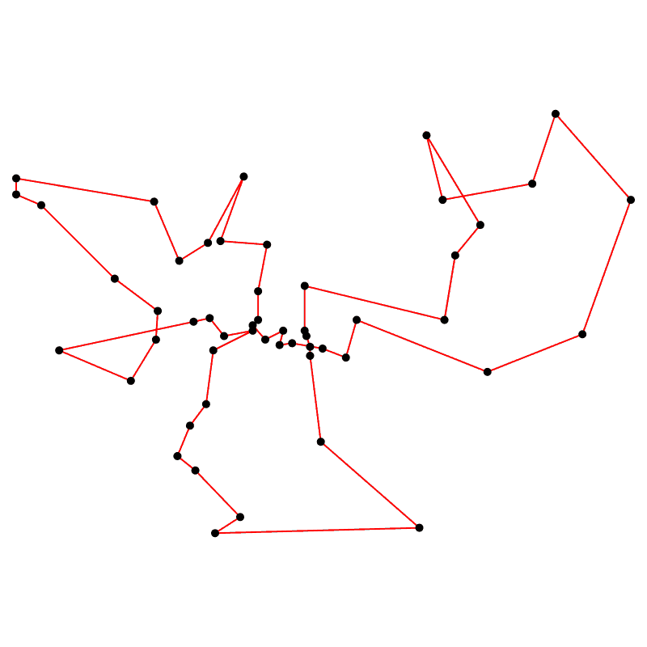

# LearnGraphs

This is a project to implement some graph algorithms and, in the process, learn some fundamentals of graph theory.

# Matching algorithms

I implemented some matching algorithms for arbitrary undirected graphs. I primarily focused on maximum-weight algorithms, and implemented (minimum-cost) maximum-cardinality matching by translating the problem into a maximum-weight algorithm.

As a baseline, I implemented a brute-force algorithm which theoretically scales with `O(2^E)`, where `E` is the number of edges in a graph. This algorithm is simple, but I still have some unit tests to demonstrate that it truly works.

As a faster algorithm, I've implemented Edmund's maximum-weight matching algorithm, which is a (very complicated) extension to the [Blossom algorithm](https://en.wikipedia.org/wiki/Blossom_algorithm). To test this algorithm, I compare its results to the brute force algorithm for small, random graphs.

## Performance comparison

In the below plot, I time matching algorithms when applied to dense graphs with random edge weights. Each measurement is averaged over three runs with independently randomized edge weights.

All tests are run on the same machine, for fair comparison.

# TSP solving

I implemented the Christofides algorithm for approximately solving the Traveling Salesman Problem. Here is an example solution for the [berlin52](https://github.com/mastqe/tsplib/blob/master/berlin52.tsp) problem:

